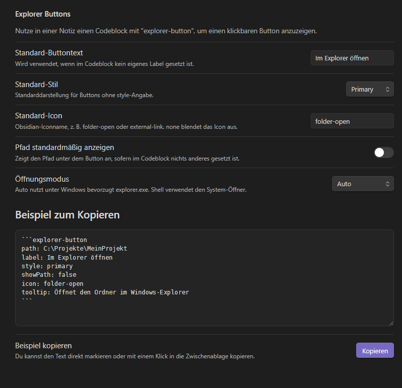

# Explorer Buttons


Ein Obsidian-Plugin für Windows, das aus einem Markdown-Codeblock einen klickbaren Button macht. Beim Klick öffnet sich der angegebene Pfad direkt im Windows-Explorer.

## Installation

1. Obsidian schließen.
2. Den Ordner `explorer-buttons` nach `<DEIN-VAULT>/.obsidian/plugins/` kopieren.
3. Darauf achten, dass der Ordnername exakt `explorer-buttons` heißt.
4. Obsidian öffnen.
5. Unter **Einstellungen → Community-Plugins** das Plugin **Explorer Buttons** aktivieren.

## Syntax

```explorer-button
path: C:\Projekte\MeinProjekt
label: Projektordner öffnen
style: primary
showPath: true
icon: folder-open
tooltip: Öffnet den Ordner im Windows-Explorer
```

## Felder

- `path`: Pflichtfeld. Dateipfad oder Ordnerpfad.
- `label`: Button-Text.
- `style`: `primary`, `secondary` oder `ghost`.
- `showPath`: `true` oder `false`.
- `icon`: Obsidian-Iconname, z. B. `folder-open`, `folder`, `external-link`.
- `tooltip`: Tooltip beim Hover.

## Einfügen per linker Obsidian-Schaltfläche

Ab Version 1.2.0 kann das Plugin links in der Obsidian-Ribbon-Leiste eine Schaltfläche anzeigen. Ein Klick fügt in die aktive Markdown-Notiz automatisch einen `explorer-button`-Codeblock ein.

Wenn **Zwischenablage als path verwenden** aktiv ist, wird der aktuelle Text aus der Zwischenablage direkt in `path:` geschrieben, zum Beispiel:

```explorer-button
path: C:\Projekte\MeinProjekt
label: Im Explorer öffnen
style: primary
showPath: false
icon: folder-open
```

Das funktioniert besonders gut, wenn du vorher einen Pfad oder Link als Text kopierst, z. B. aus der Explorer-Adressleiste. Wenn die Zwischenablage leer oder nicht als Text lesbar ist, wird `path:` leer eingefügt und kann manuell ergänzt werden.

Zusätzlich gibt es den Befehl **Explorer-Button-Codeblock einfügen** in der Befehlspalette. Dieser nutzt dieselben Einstellungen wie die linke Schaltfläche.

## Einstellungen

- **Standard-Buttontext**: Wird für neue Codeblöcke und für gerenderte Buttons ohne eigenes `label` verwendet.
- **Standard-Stil**: `primary`, `secondary` oder `ghost`.
- **Standard-Icon**: Obsidian-Iconname oder `none`.
- **Pfad standardmäßig anzeigen**: Setzt den Standardwert für `showPath`.
- **Schaltfläche links anzeigen**: Schaltet die Ribbon-Schaltfläche links in Obsidian an oder aus.
- **Zwischenablage als path verwenden**: Schreibt beim Einfügen den aktuellen Zwischenablage-Text direkt in `path:`.
- **Öffnungsmodus**: `auto`, `Immer Explorer` oder `System-Shell`.



## Kurzform

Wenn nur ein Pfad eingetragen ist, reicht auch das:

```explorer-button
C:\Projekte\MeinProjekt
```

## Unterstützte Platzhalter

- `{{vault}}` → absoluter Vault-Pfad
- `{{fileDir}}` → Ordner der aktuellen Notiz
- `%USERPROFILE%` und andere Windows-Umgebungsvariablen
- `~` → Benutzerordner

## Beispiele

### Vault-Unterordner öffnen

```explorer-button
path: {{vault}}\Assets\Exports
label: Exports öffnen
style: secondary
```

### Ordner relativ zur aktuellen Notiz öffnen

```explorer-button
path: {{fileDir}}\..\Ressourcen
label: Ressourcen öffnen
style: primary
```

### Datei im Explorer markieren

```explorer-button
path: C:\Projekte\MeinProjekt\briefing.pdf
label: PDF im Explorer zeigen
icon: file
```

## Verhalten

- Ordnerpfade werden direkt geöffnet.
- Dateipfade werden im Windows-Explorer markiert.
- Ungültige Pfade zeigen eine Fehlermeldung in Obsidian.

## Version 1.2.0

- Neue optionale Schaltfläche links in der Obsidian-Ribbon-Leiste.
- Neuer Befehl **Explorer-Button-Codeblock einfügen**.
- Optionales Einfügen des aktuellen Zwischenablage-Texts direkt in `path:`.
- Neue Einstellungen zum An-/Ausschalten der linken Schaltfläche und der Zwischenablage-Nutzung.

## Version 1.1.0

- Die Einstellungen enthalten jetzt ein direkt kopierbares Beispiel mit Kopieren-Button.
- Das Beispiel aktualisiert sich passend zu den Standardwerten im Plugin.
